# AI Document Processing Application: Project Analysis

## 1. Introduction

The AI Document Processing Application is a cutting-edge web platform that leverages artificial intelligence to streamline the analysis, summarization, and interaction with academic and research documents. This project combines a modern Next.js frontend with a Flask-based backend to create a comprehensive tool designed specifically for researchers, students, and academics who need to process and extract insights from complex documents efficiently.

### Purpose and Motivation

This application was developed to address the growing need for AI-assisted research tools that can help users navigate the overwhelming volume of academic literature. Researchers often struggle with information overload, making it difficult to efficiently extract relevant insights from papers, identify connections between studies, and formulate comprehensive understanding of complex topics. This tool aims to solve these problems by applying state-of-the-art AI to automate and enhance document processing tasks.

### Technology Overview

The project implements a full-stack architecture that incorporates multiple modern technologies:

**Frontend Technologies:**
- **Next.js 15 with React 19**: Provides a robust framework for building a responsive, server-rendered user interface with the latest React features.
- **TypeScript**: Ensures type safety and improves code maintainability with static type checking.
- **TailwindCSS**: Enables rapid UI development with utility-first CSS design patterns and consistent styling.
- **React Markdown**: Renders markdown content from AI-generated responses for better readability.

**Backend Technologies:**
- **Flask**: A lightweight Python web framework that serves as the API backend.
- **LangChain**: Orchestrates complex AI operations, manages document processing workflows, and connects to various AI models.
- **MongoDB**: Provides document-based storage for user data, document metadata, and interaction history.
- **Generative AI Models**: Leverages advanced language models for document summarization, question answering, and recommendation tasks.

## 2. Functionalities

The application offers several core functionalities designed to enhance the research workflow:

### Document Summarization

**Description**: Allows users to upload research papers (PDF format) and receive AI-generated comprehensive summaries of the content.

**Technologies Used**:
- **Frontend**: React components for file uploading and markdown rendering
- **Backend**: LangChain document processors and text splitters
- **Models**: Uses large language models to generate concise yet informative summaries
- **Storage**: Stores processed documents in MongoDB for future reference

**Flow**:
1. User uploads a PDF document via the web interface
2. Backend processes and extracts text from the PDF
3. Text is split into manageable chunks and processed by the document processor
4. AI model generates a comprehensive summary
5. Summary is presented to the user with proper formatting

### Question Answering

**Description**: Enables users to ask specific questions about uploaded documents and receive precise answers based on the document's content.

**Technologies Used**:
- **Frontend**: Interactive question input interface with real-time feedback
- **Backend**: Vector storage for semantic search capabilities
- **Models**: Utilizes embedding models to convert document chunks and queries into vector representations
- **Processing**: Creates a retrieval-augmented generation system that finds relevant context before generating answers

**Flow**:
1. User uploads a document (if not already done)
2. Document is processed and indexed in a vector database
3. User enters a specific question about the document
4. System retrieves relevant document chunks that might contain the answer
5. AI model generates an answer based on the retrieved context
6. Answer is displayed to the user with source references when applicable

### Research Paper Recommendations

**Description**: Suggests related research papers based on the user's current documents or specific research interests.

**Technologies Used**:
- **Frontend**: Card-based UI for displaying recommendations
- **Backend**: Document similarity algorithms
- **APIs**: Integration with academic paper databases and search engines
- **Models**: Embedding models to represent papers and find semantic similarities

**Flow**:
1. System analyzes user's uploaded documents or explicit topic interests
2. Backend searches for semantically similar papers in connected databases
3. Results are filtered and ranked by relevance
4. Top recommendations are presented to the user with relevant metadata

### Report Generation

**Description**: Creates structured reports from research documents, extracting key information and organizing it into cohesive sections.

**Technologies Used**:
- **Frontend**: Template selection interface and preview capabilities
- **Backend**: Document structure analysis
- **Models**: Specialized models for identifying document sections and extracting structured information

**Flow**:
1. User selects a document and a report template
2. System analyzes the document structure to identify key sections
3. AI extracts and organizes relevant information according to the template
4. A structured report is generated and presented to the user
5. User can edit and customize the report before finalizing

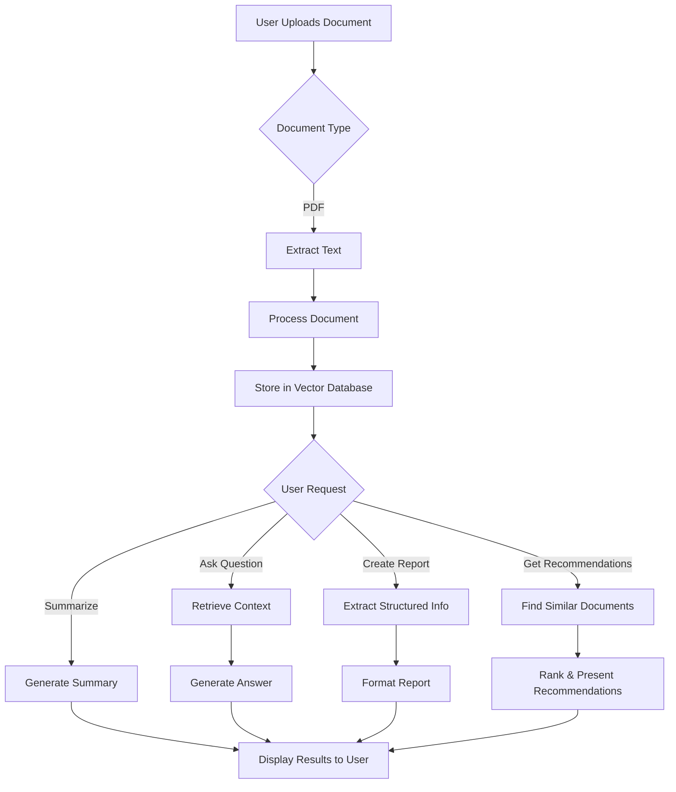

## 3. Models and APIs

The application leverages several AI models and external APIs to deliver its core functionalities:

### Language Models

1. **Google Generative AI (Gemma 7B)**
   - **Usage**: Primary model for generating summaries and answering questions
   - **Implementation**: Integrated through Hugging Face API in the `qa_model.py` file
   - **Features**: Provides context-aware responses based on document content

2. **Embedding Models**
   - **Type**: HuggingFace embeddings
   - **Usage**: Creates vector representations of document chunks for semantic search
   - **Implementation**: Used in `document_processor.py` for indexing and retrieval
   - **Features**: Enables semantic similarity search for finding relevant document sections

### Document Processing Tools

1. **LangChain Document Loaders**
   - **Usage**: Extract text and metadata from PDFs
   - **Implementation**: Used in the document processor component
   - **Features**: Handles various document formats and maintains structural information

2. **LangChain Text Splitters**
   - **Usage**: Divides documents into manageable chunks while preserving context
   - **Implementation**: RecursiveCharacterTextSplitter in document_processor.py
   - **Features**: Intelligent text chunking that respects semantic boundaries

### Vector Databases

1. **Chroma Vector Store**
   - **Usage**: Stores document embeddings for efficient semantic retrieval
   - **Implementation**: Integrated in document_processor.py
   - **Features**: Performs similarity searches to find relevant document sections for questions

### External APIs

1. **Hugging Face API**
   - **Usage**: Accesses hosted AI models for inference
   - **Implementation**: Used in qa_model.py to query the Gemma model
   - **Features**: Provides reliable model hosting and inference capabilities

2. **Authentication Services**
   - **Usage**: User authentication and profile management
   - **Implementation**: Custom implementation in the Flask backend
   - **Features**: Secure password handling with bcrypt

## 4. Architecture

The application follows a modern web architecture pattern with clear separation of concerns:

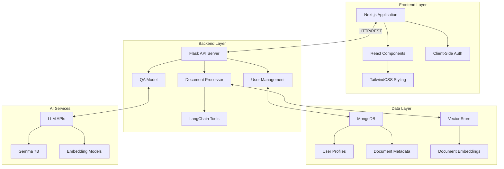

### Execution Flow

The following diagram illustrates the typical execution flow for processing a document and answering a question:

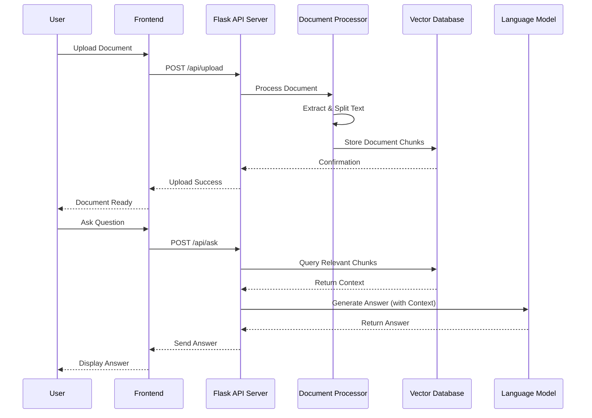

### Component Architecture

The application is organized into several key components:

1. **UI Layer**
   - Page Components: Home, Login, Signup, Summarization, QA, etc.
   - Shared Components: Navigation, Cards, Input forms
   - Context Providers: Theme, Auth, etc.

2. **API Layer**
   - REST Endpoints for document processing, user management, etc.
   - WebSocket connections for real-time updates (future enhancement)

3. **Processing Layer**
   - Document handlers for different file types
   - AI model integrations
   - Vector database management

4. **Data Layer**
   - Database schemas for users, documents, history
   - File storage for uploaded documents
   - Vector indices for semantic search

## 5. System Diagrams

### Proposed System Diagram

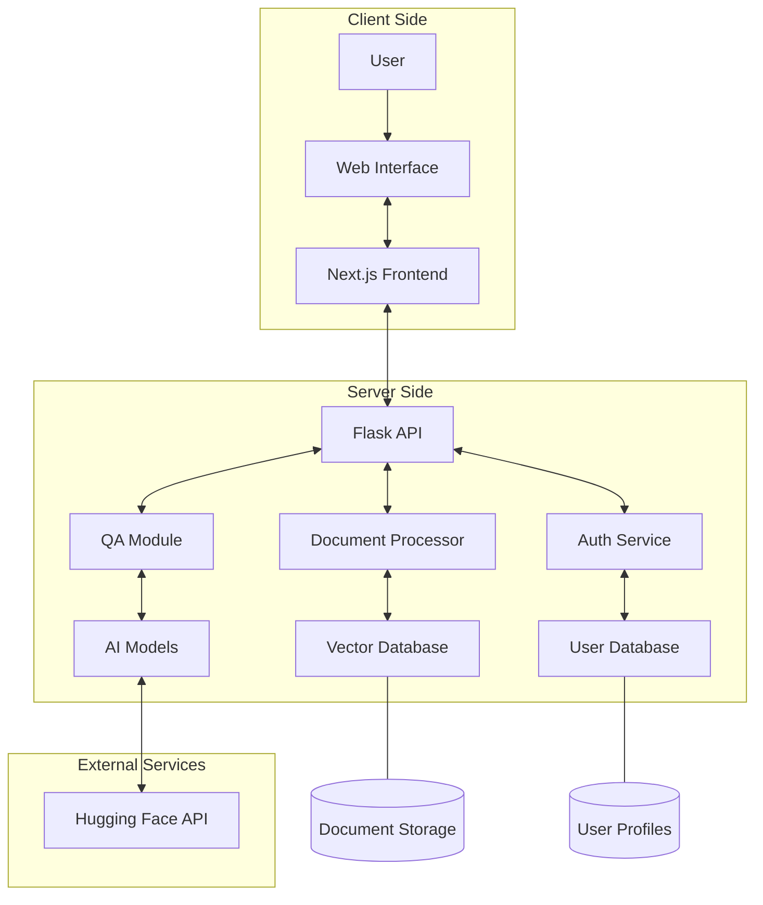

### Block Diagram

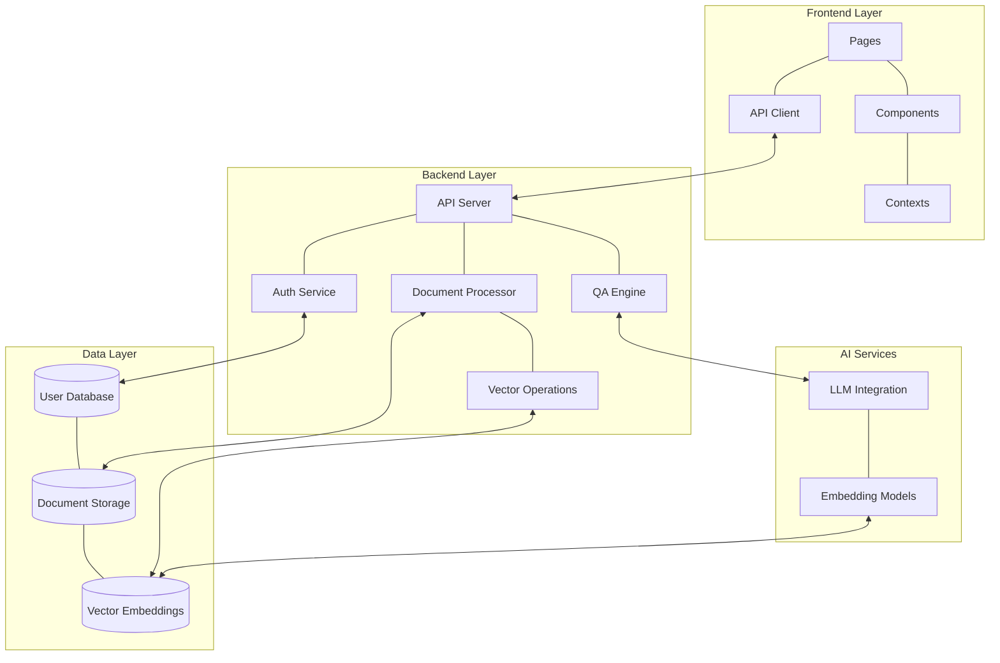

### Component Diagram

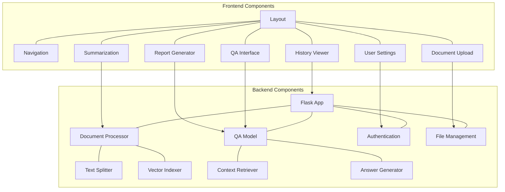

### Use Case Diagram

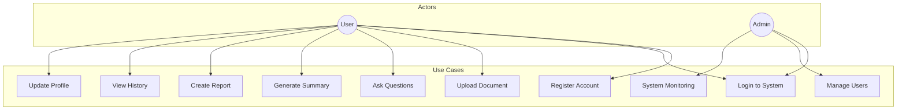

### Data Flow Diagram

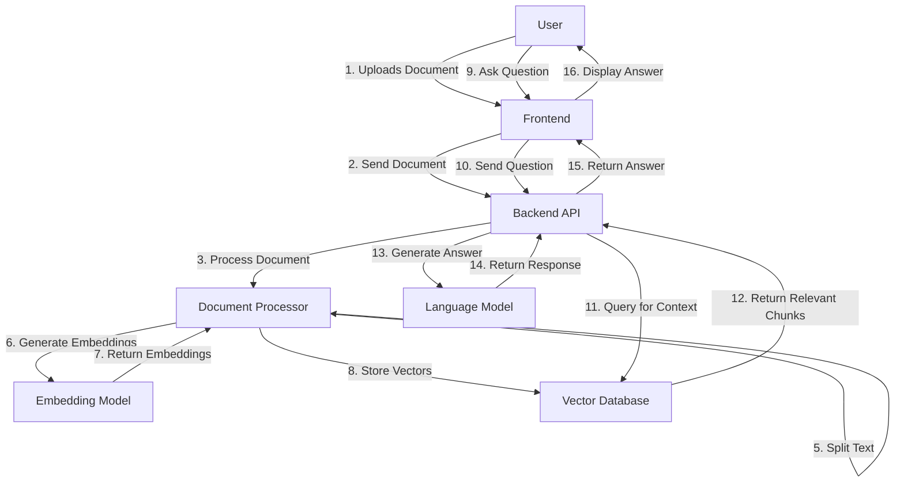

### Class Diagram

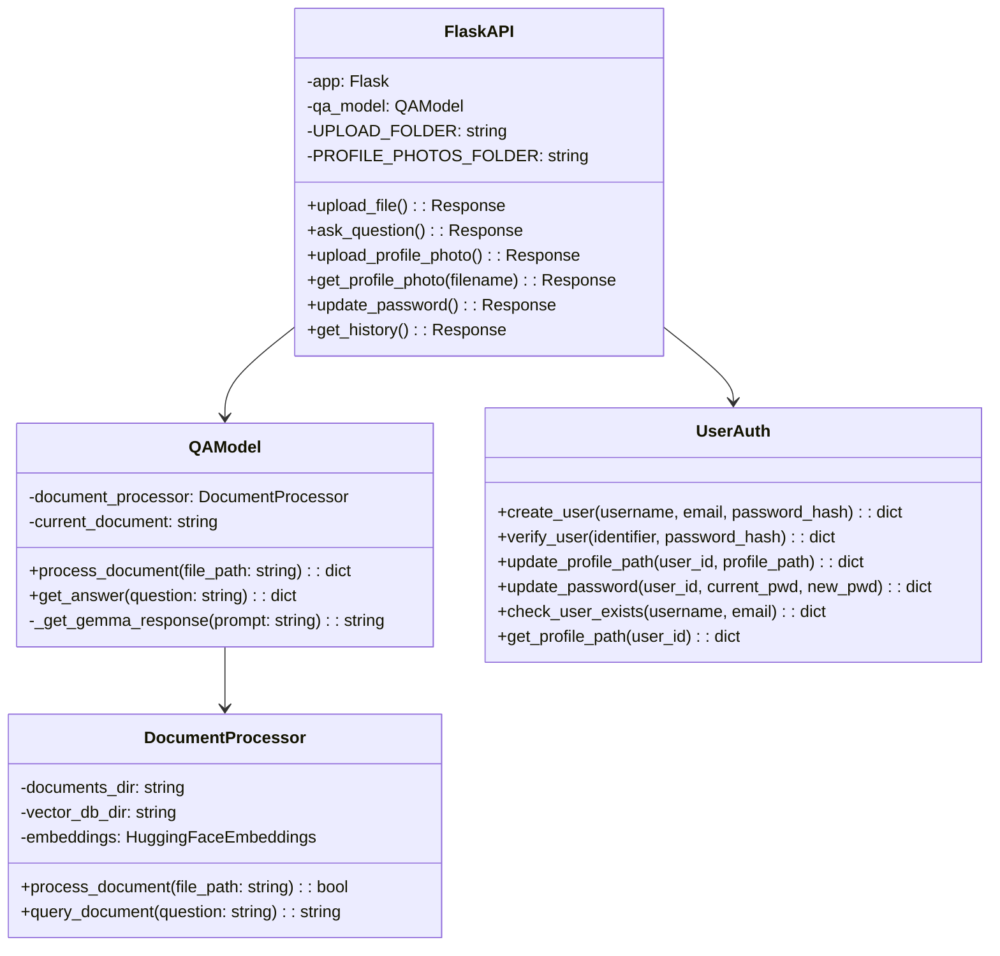

### Sequence Diagram

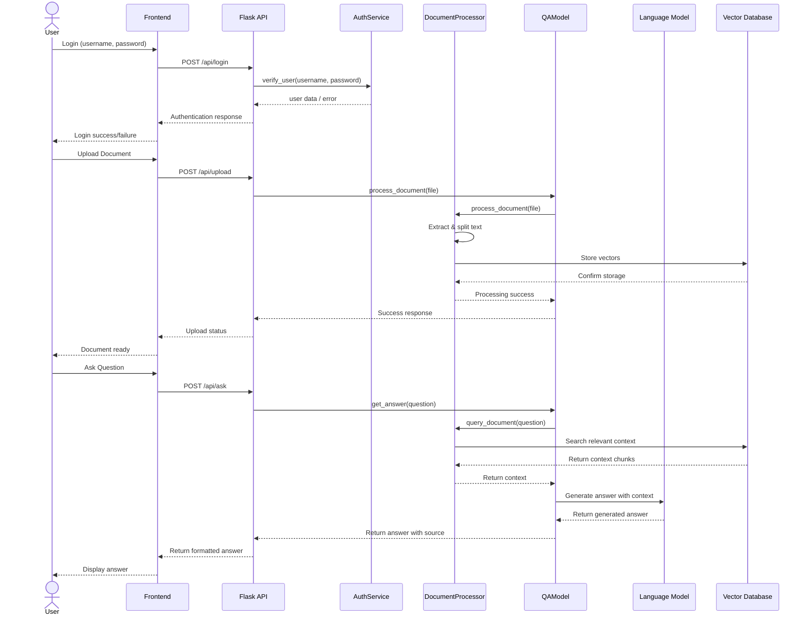

### Database Design Diagram

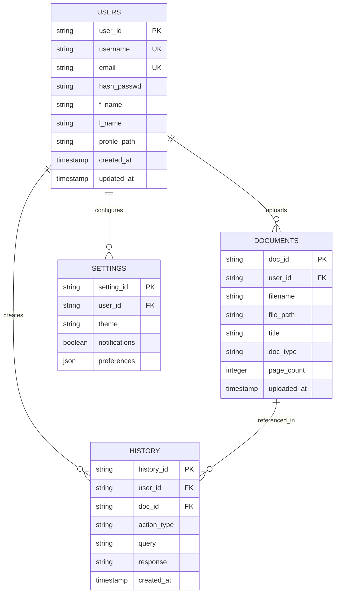

## 5. Conclusion

The AI Document Processing Application demonstrates a sophisticated integration of modern web technologies with state-of-the-art AI capabilities. By combining Next.js and React on the frontend with Flask and LangChain on the backend, the application delivers a seamless user experience for complex document processing tasks.

The project showcases several noteworthy architectural decisions:

1. **Separation of Concerns**: Clear division between frontend, backend, and AI processing components
2. **Scalable Vector Storage**: Implementation of efficient document retrieval using vector databases
3. **Responsive UI**: Modern interface with dark/light mode support and mobile-friendly design
4. **Secure Authentication**: Proper password hashing and user session management
5. **Modular Architecture**: Well-organized codebase that facilitates future extensions

Future enhancements could include:
- Integration with academic databases for direct paper access
- Collaborative features for team research
- Advanced visualization of document relationships
- Custom training of domain-specific models for specialized research fields
- Implementation of a citation management system

This application represents a significant step forward in AI-assisted research tools, providing researchers with powerful capabilities to navigate and extract insights from the ever-growing body of academic literature. 