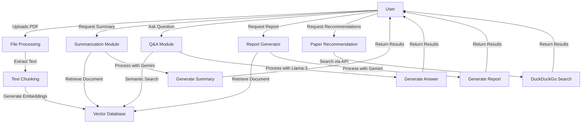
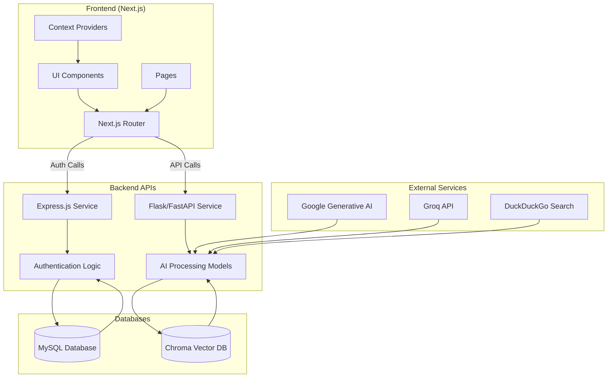
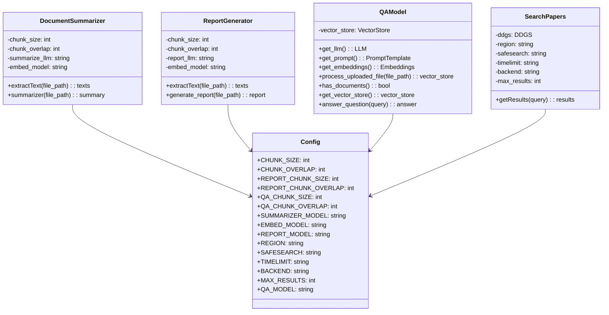
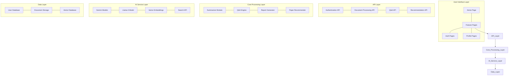
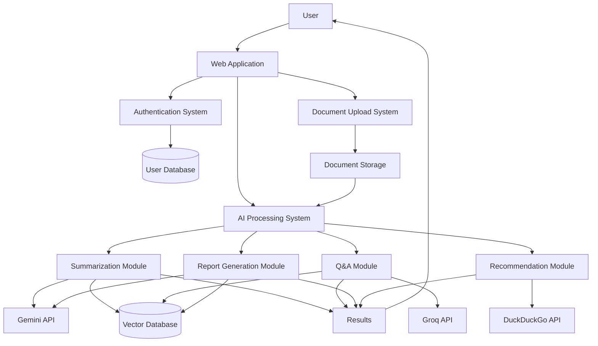
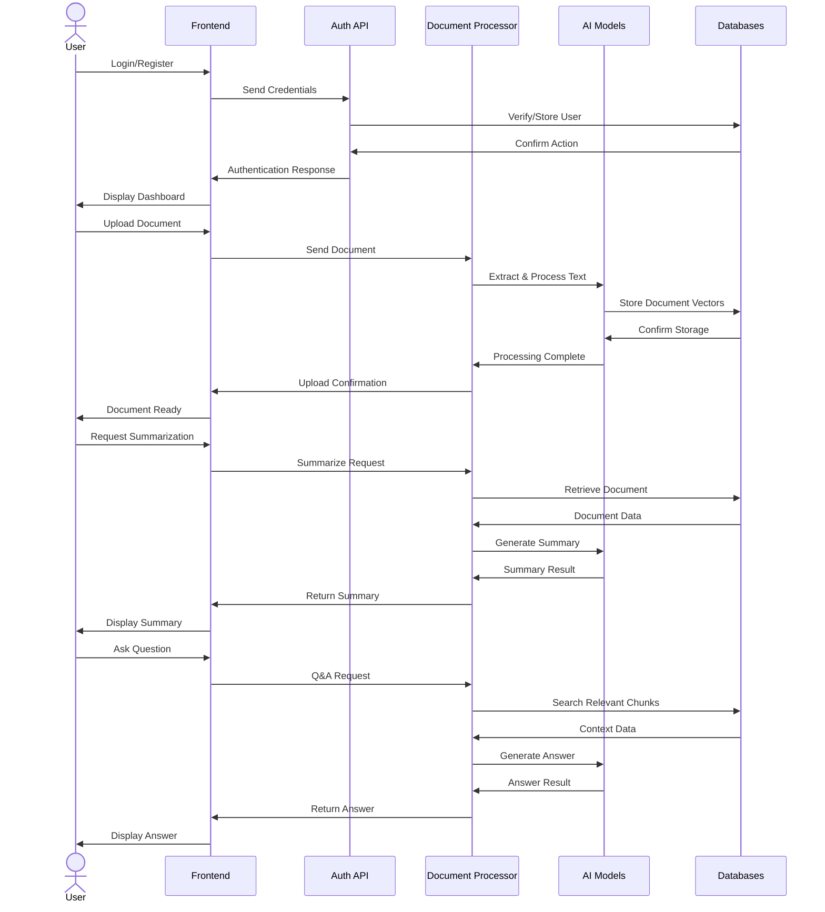
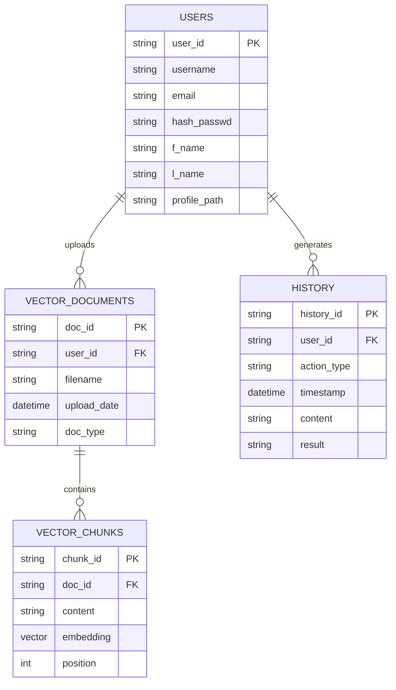
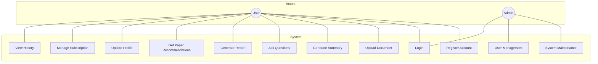
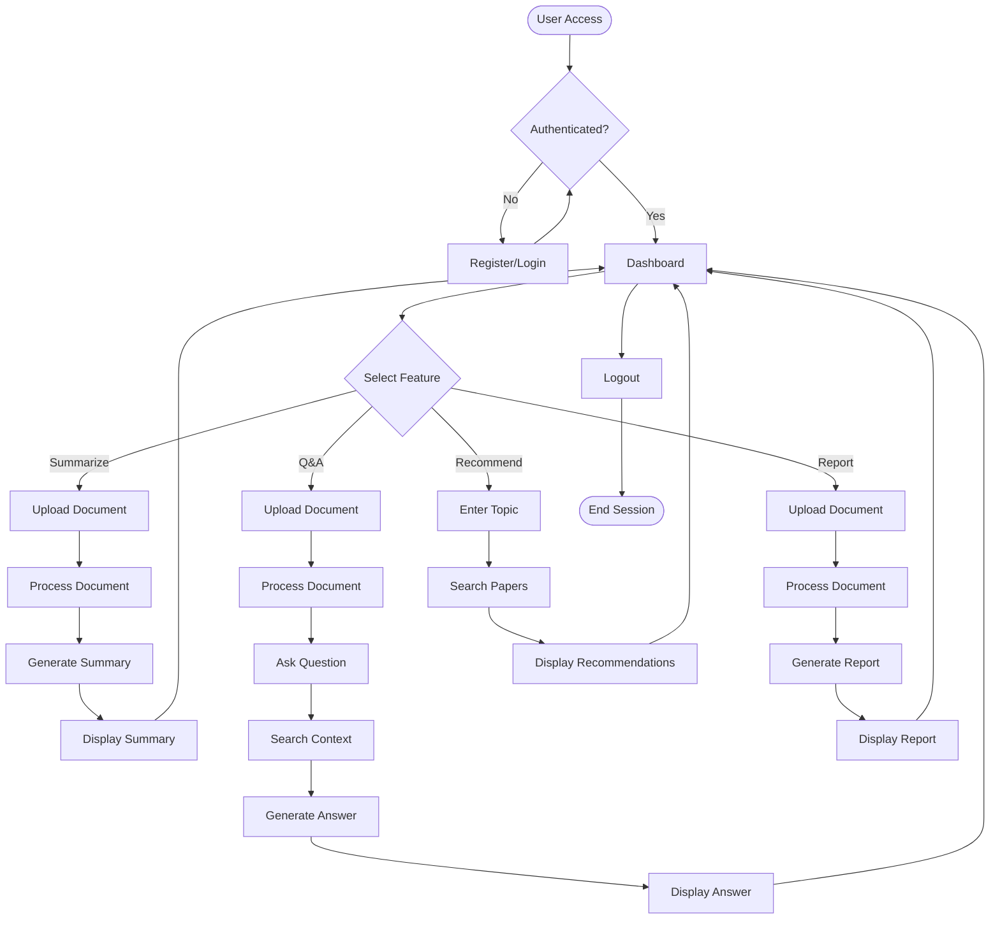

# AI Inspired Research Buddy - Project Analysis Report

## 1. Introduction

**AI Inspired Research Buddy** is a comprehensive research assistance platform designed to streamline and enhance academic and scientific research processes through artificial intelligence. The project leverages modern web technologies alongside advanced AI models to create an intuitive, user-friendly interface for researchers, students, and professionals who need to process, analyze, and extract insights from academic papers and research documents.

The platform was created to address common pain points in the research workflow: the time-consuming nature of reading extensive papers, difficulty in extracting key information quickly, and challenges in connecting research findings to relevant literature. By automating these processes, the Research Buddy aims to dramatically improve research productivity and effectiveness.

### Technology Stack

The project is built on a hybrid architecture combining:

- **Frontend**: Next.js 15 with React 19, utilizing TypeScript for type safety and Tailwind CSS for styling
- **Backend API**: Flask/FastAPI (Python) for AI processing and Express.js (Node.js) for authentication
- **Database**: MySQL for user authentication and Chroma vector database for document storage
- **AI Models**: Google Gemini models for summarization and report generation, Groq with Llama-3 for Q&A functionality
- **Vector Embeddings**: Google Generative AI Embeddings for document processing

This technology combination allows for a responsive, modern UI on the frontend while leveraging powerful AI capabilities on the backend to process and analyze research documents.

## 2. Functionalities

The Research Buddy offers several key features designed to assist researchers throughout their workflow:

### Document Summarization
**Technology**: Gemini 2.5 Pro
**Implementation**: The platform uses the `DocumentSummarizer` class to:
1. Extract and preprocess text from PDF documents using PyPDFLoader
2. Split documents into manageable chunks with RecursiveCharacterTextSplitter
3. Apply embeddings clustering to identify key sections
4. Generate concise, structured summaries through the Gemini model
5. Format results in Markdown for better readability

### Question & Answer with Research Documents
**Technology**: Groq API with Llama-3 8B model
**Implementation**:
1. Documents are processed via the `QAModel` class
2. Content is split into semantic chunks and embedded using Google's embedding model
3. Chunks are stored in a Chroma vector database for efficient retrieval
4. User questions trigger semantic similarity search against the document chunks
5. Retrieved context is sent to the LLM along with the question for accurate answers

### Research Report Generation
**Technology**: Gemini 2.5 Pro
**Implementation**:
1. Similar to summarization but with a more structured approach
2. The `ReportGenerator` class processes PDF documents
3. Uses clustering to identify important sections
4. Generates comprehensive, formal reports with proper sections, headings, and formatting
5. Outputs are formatted in Markdown with scientific report structure

### Research Paper Recommendations
**Technology**: DuckDuckGo Search API
**Implementation**:
1. The `SearchPapers` class interfaces with DuckDuckGo's search API
2. Searches are refined to focus on academic and research papers
3. Customizable parameters for region, time limits, and safety filters
4. Returns relevant papers based on user queries or document content

### User Authentication & Profile Management
**Technology**: MySQL, Express.js, bcrypt
**Implementation**:
1. Secure user registration and login system
2. Password hashing for security
3. Profile image upload and management
4. Session management with local storage

### Flow Chart of Core Functionality

## 3. Models and APIs Used

### AI Models

| Model | Purpose | Location |
|-------|---------|----------|
| **Gemini 2.5 Pro** | Document summarization | `core_module/summarizer.py` |
| **Gemini 2.5 Pro** | Report generation | `core_module/report_generator.py` |
| **Llama-3 8B (via Groq)** | Question answering | `core_module/qa_model.py` |
| **Google Generative AI Embeddings** | Vector embeddings for document chunks | Used across all AI modules |

### APIs

| API | Purpose | Location |
|-----|---------|----------|
| **Google Generative AI API** | Access to Gemini models | `core_module/summarizer.py`, `core_module/report_generator.py` |
| **Groq API** | Fast inference for Llama-3 model | `core_module/qa_model.py` |
| **DuckDuckGo Search API** | Research paper recommendations | `core_module/recommedPapers.py` |
| **Flask/FastAPI Endpoints** | Backend processing of documents | `api/api.py` |
| **Express.js Endpoints** | User authentication and profile management | `api/api.py` |

### Authentication and Database

The application uses MySQL for user authentication and profile management. User credentials are securely stored with password hashing via bcrypt. The database schema includes tables for users with profile information including paths to profile images.

## 4. Architecture Diagrams

### Component Diagram

### Class Diagram

### Block Diagram

### Proposed System Diagram

### Sequence Diagram

### Database Diagram

### Use Case Diagram

### Execution Flow Diagram

## 5. Conclusion

The AI Inspired Research Buddy represents a comprehensive solution for researchers looking to streamline their workflow through AI-powered tools. By integrating multiple AI models and services, the platform provides a complete research assistance ecosystem that can significantly reduce the time and effort required to process academic literature.

The architecture follows modern best practices with a clear separation of concerns between the frontend and backend components. The use of Next.js for the frontend provides a responsive and user-friendly interface, while the Python-based AI processing backend leverages state-of-the-art language models for advanced document understanding.

The system's modular design allows for easy expansion with additional features in the future, such as citation management, collaborative research workspaces, or integration with academic databases. The current implementation already demonstrates the power of combining multiple AI capabilities into a cohesive research tool.

By addressing key pain points in the research process—document understanding, information extraction, and literature discovery—the Research Buddy has the potential to significantly enhance research productivity across academic disciplines. 